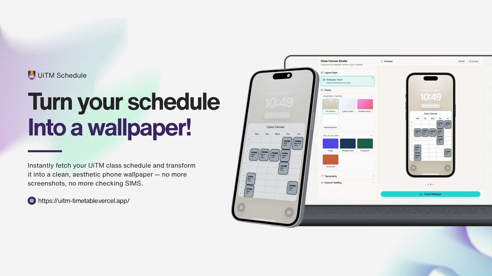

# UiTM Schedule

<p align="center">
  
</p>

<p align="center">
  Search UiTM class schedules, compare groups, detect clashes, and turn the final timetable into a phone wallpaper.
</p>

<p align="center">
  <a href="https://uitm-timetable.vercel.app/">Live Site</a>
  ·
  <a href="#tech-stack">Tech Stack</a>
  ·
  <a href="#contributing">Contributing</a>
</p>

## What Is This?

`UiTM Schedule` is a web app for UiTM students who want a cleaner way to work with their class timetable.

Instead of jumping between SIMS pages and screenshots, the site lets users:

- search for a subject by campus, faculty, and course code
- fetch matching timetable entries from the UiTM timetable portal
- choose the correct group for each subject
- spot schedule clashes across selected groups
- preview the final timetable in multiple layouts
- export the result as a polished wallpaper image for mobile use

The app is built around one core idea: make timetable planning fast, visual, and easy to keep on your lock screen.

## How It Works

1. The user selects a campus, faculty when required, and a course code.
2. The app queries the UiTM timetable portal and returns matching subject results.
3. The user picks the relevant subject and group combination.
4. The app combines the selected sessions, highlights clashes, and renders timetable views.
5. The wallpaper maker exports the final schedule as a JPG image.

## Features

- Subject search flow tailored to UiTM timetable data
- Group selection across multiple subjects
- Clash detection for overlapping classes
- Weekly grid and list/table timetable views
- Wallpaper generator with multiple layout presets
- Image export for phone wallpapers
- Responsive UI built for desktop and mobile

## Tech Stack

| Layer | Tools |
| --- | --- |
| Framework | Next.js 16, React 19, TypeScript |
| Styling | Tailwind CSS 4 |
| UI | shadcn/ui, Base UI, Lucide icons |
| Data fetching | Native `fetch`, Axios |
| Scraping/parsing | Cheerio, Axios, Tough Cookie support |
| Image export | `html-to-image` |
| Analytics | Vercel Analytics |
| Deployment | Vercel |

## Project Structure

```text
app/                  App routes, pages, and API endpoints
components/           UI pieces, timetable views, wallpaper maker
lib/                  Scraper logic, constants, types, utilities
public/               Static assets and social preview image
```

## Running Locally

### Prerequisites

- Node.js 20+ recommended
- npm

### Setup

```bash
npm install
npm run dev
```

Then open [http://localhost:3000](http://localhost:3000).

### Available Scripts

```bash
npm run dev
npm run build
npm run start
npm run lint
```

## Contributing

Contributions are welcome, especially around timetable accuracy, UI polish, export quality, and scraper resilience.

### Contribution Workflow

1. Fork the repository.
2. Create a feature branch.
3. Make your changes.
4. Run linting and any relevant local checks.
5. Open a pull request with a clear description of the problem and solution.

### Recommended Branch Naming

```text
feature/short-description
fix/short-description
docs/short-description
```

### Pull Request Guidelines

- Keep changes focused and scoped
- Explain any UI or behavior changes clearly
- Include screenshots or recordings for visual updates when possible
- Mention scraper-related assumptions if the UiTM source markup changed
- Avoid unrelated refactors in the same PR

### Development Notes

- API routes under `app/api/*` handle timetable lookup and search requests.
- Scraper logic lives in `lib/scraper.ts`.
- Wallpaper generation UI is under `components/wallpaper-maker-v2/`.
- If UiTM changes its timetable markup or request flow, scraper fixes will likely be needed.

## Why This Project Exists

UiTM students often rely on static screenshots or repeated SIMS checks to keep track of class schedules. This project turns that process into a faster workflow: fetch, compare, customize, export.

## Live Demo

Production URL: [https://uitm-timetable.vercel.app/](https://uitm-timetable.vercel.app/)
